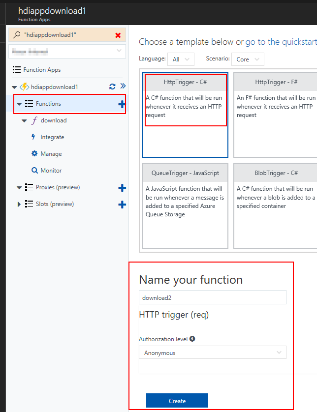
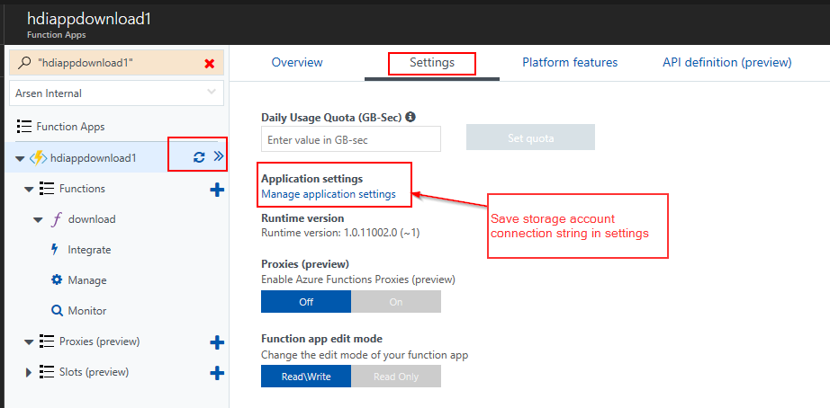

# Azure Function Redirect to Binary Blob Download

The function has a public URL that can be invoked from script to download binaries if the license key string is valid

```
wget -O $fileName -q "https://hdiappdownload1.azurewebsites.net/api/download?licenseKey=$licenseKey&fileName=$fileName"
```

## Create Azure Function
[]

## Set Azure Function Settings
[]
